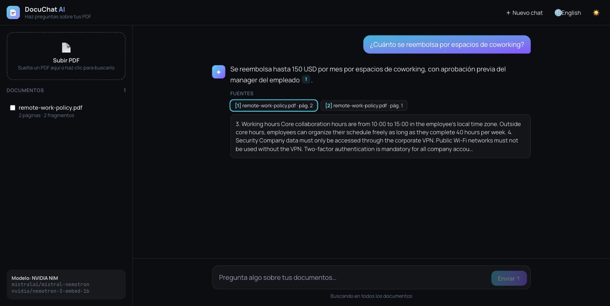

# DocuChat AI

[](https://github.com/MigueIAngel/docuchat-ai/actions/workflows/ci.yml)


Chat with your PDF documents. DocuChat AI is a **retrieval-augmented generation (RAG)** app: it indexes your PDFs, retrieves the passages relevant to each question and streams an answer that **cites the exact pages** it came from. It works with **NVIDIA NIM** or **Google Gemini**, and also runs offline in demo mode.



## How it works

```
                 ┌──────────── ingestion ─────────────┐
PDF ──▶ pypdf ──▶ chunks (per page, overlap) ──▶ embeddings (passage) ──▶ ChromaDB
                                                                         │
Question ──▶ embedding (query) ──▶ top-k search ◀────────────────────────┘
                     │
                     ▼
     grounded prompt with numbered passages ──▶ LLM ──▶ SSE stream ──▶ React UI
                                                      (sources + tokens)
```

1. **Extract**: text from each page with `pypdf`. Encrypted or scanned PDFs are rejected with a clear error.
2. **Chunk**: sentence-aware chunks (~900 characters, 150 overlap) that never cross pages, so every passage can be cited with a single page number.
3. **Embed**: the provider's embedding model. NVIDIA uses asymmetric `passage`/`query` embeddings.
4. **Store**: ChromaDB (cosine) keeps one collection per provider/model, because vectors from different models are not comparable. A SQLite registry stores document metadata.
5. **Retrieve and answer**: top-k passages, optionally limited to the selected documents, go into a grounded prompt. The model must cite `[n]`, answer in the question's language and say so when the answer is not in the documents.
6. **Stream**: Server-Sent Events send `sources` first, then `token`s, then `done`.

## Features

- Upload PDFs (drag & drop), list them, delete them, and choose which ones to search
- **Streaming answers** with a stop button, suggested questions and follow-up questions (the conversation history is sent along)
- **Clickable citations** `[n]` that show the source passage, file and page
- Providers:
  - **NVIDIA NIM**: `mistralai/mistral-nemotron` + `nvidia/nemotron-3-embed-1b`
  - **Gemini**: `gemini-3.5-flash` + `gemini-embedding-001`
  - **Demo**: an offline fallback when no key is set, also used by the test suite
- Both providers go through their **OpenAI-compatible APIs**, so a single client implementation covers them
- Safe Markdown rendering in the UI (no raw HTML), English/Spanish, dark/light theme
- Tests (pytest + Vitest), Docker Compose (nginx configured for SSE) and CI that needs no secrets

## Tech stack

| Layer | Tools |
|---|---|
| Backend | FastAPI, Pydantic Settings, OpenAI Python SDK, pypdf, ChromaDB, SQLite |
| LLMs | NVIDIA NIM, Google Gemini (OpenAI-compatible endpoints) |
| Frontend | React 19, TypeScript, Vite 8, Tailwind CSS 4, react-i18next |
| Quality | pytest, Vitest, Testing Library, Ruff, oxlint |
| DevOps | Docker, docker-compose, nginx, GitHub Actions |

## Getting started

### 1. API key (optional)

Get a free key from [build.nvidia.com](https://build.nvidia.com) or [Google AI Studio](https://aistudio.google.com), then:

```bash
cp backend/.env.example backend/.env
# set LLM_PROVIDER=nvidia and NVIDIA_API_KEY=...   (or LLM_PROVIDER=gemini and GEMINI_API_KEY=...)
```

Without a key the app runs in **demo mode**: it uses keyword embeddings and returns an extractive answer.

### 2a. Docker

```bash
docker compose up --build
```

Open http://localhost:8080 and click **"Try it with the sample document"**.

### 2b. Local development

```bash
# Backend (http://localhost:8000, docs at /docs)
cd backend
python -m venv .venv && source .venv/bin/activate
pip install -r requirements-dev.txt
uvicorn app.main:app --reload

# Frontend (http://localhost:5173, proxies /api to :8000)
cd frontend
npm install
npm run dev
```

### Tests

```bash
cd backend && pytest     # offline, demo provider
cd frontend && npm test
```

## API

| Method | Endpoint | Description |
|---|---|---|
| `GET` | `/api/health` | Status, active provider and models |
| `GET` | `/api/documents` | Indexed documents |
| `POST` | `/api/documents` | Upload a PDF (`multipart/form-data`, field `file`) |
| `DELETE` | `/api/documents/{id}` | Remove a document and its vectors |
| `POST` | `/api/chat` | `{ question, document_ids?, history? }` → `text/event-stream` |

```bash
curl -N -X POST localhost:8000/api/chat -H "Content-Type: application/json" \
  -d '{"question":"How much is reimbursed for coworking spaces?"}'
# event: sources
# data: [{"id": 1, "filename": "remote-work-policy.pdf", "page": 2, ...}]
# event: token
# data: "Up to 150 USD per month"
# ...
# event: done
```

## Project structure

```
backend/app/
├── api/            # documents + chat (SSE) routers, dependencies
├── core/config.py  # provider selection and model defaults
└── services/       # pdf, chunking, llm providers, vector store, prompt
frontend/src/
├── api/            # REST client + streaming chat
├── components/     # Sidebar, Chat, Message
├── lib/            # SSE parser, Markdown renderer, useChat hook
└── i18n/           # en.json, es.json
samples/            # sample PDF used in the demo
```

## License

MIT
